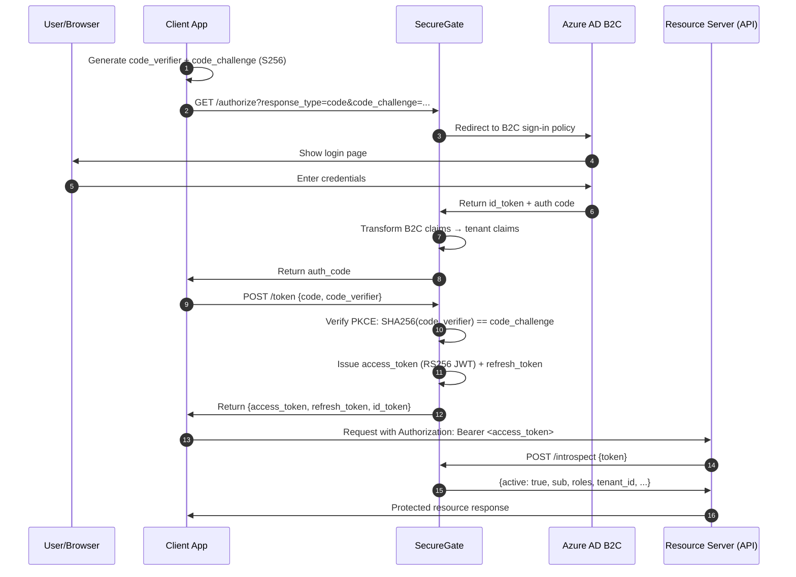
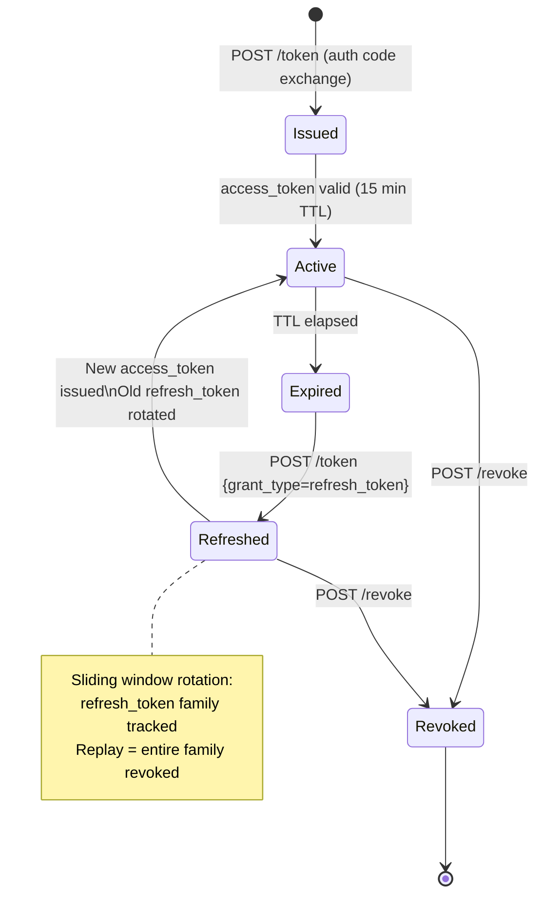

# SecureGate

> A multi-tenant OAuth 2.0 / OpenID Connect Identity & Access Management microservice built with ASP.NET Core 8.

[](https://dotnet.microsoft.com/)
[](https://learn.microsoft.com/en-us/aspnet/core/)
[](https://azure.microsoft.com/en-us/products/active-directory/external-identities/b2c)
[](LICENSE)

---

## Overview

SecureGate is a production-grade authentication and authorization service that centralises identity management across multiple tenants. It implements the **OAuth 2.0 Authorization Code Flow with PKCE** and **OpenID Connect** on top of ASP.NET Core, integrates **Azure AD B2C** as an external Identity Provider, and enforces fine-grained **Role-Based Access Control (RBAC)** via policy-based middleware.

### Key Features

- OAuth 2.0 Authorization Code Flow with PKCE (RFC 7636)
- OpenID Connect (OIDC) with RS256-signed JWT access and refresh tokens
- Multi-tenant architecture with tenant-scoped claims
- Azure AD B2C integration with custom policy claims transformation
- RBAC via ASP.NET Core policy-based authorization middleware
- Secure credential storage using PBKDF2 with per-user salts
- Token introspection and revocation endpoints (RFC 7662 / RFC 7009)
- Sliding-window refresh token rotation (RFC 6819)
- CSRF and replay attack protection on all token endpoints

---

## Architecture

### High-Level System Architecture

```
┌─────────────────────────────────────────────────────────────────────┐
│                          CLIENT APPLICATIONS                        │
│                                                                     │
│   ┌──────────────┐    ┌──────────────┐    ┌──────────────────────┐ │
│   │  Web App     │    │  Mobile App  │    │  Third-party Service │ │
│   │  (SPA/MVC)   │    │  (iOS/Android│    │  (M2M / client creds)│ │
│   └──────┬───────┘    └──────┬───────┘    └──────────┬───────────┘ │
└──────────┼────────────────── ┼───────────────────────┼─────────────┘
           │  Auth Code + PKCE │                        │ Client Credentials
           ▼                   ▼                        ▼
┌─────────────────────────────────────────────────────────────────────┐
│                        SECUREGATE SERVICE                           │
│                                                                     │
│  ┌──────────────────┐   ┌────────────────────┐  ┌───────────────┐  │
│  │  /authorize      │   │  /token            │  │  /introspect  │  │
│  │  endpoint        │   │  endpoint          │  │  /revoke      │  │
│  │  (PKCE challenge)│   │  (JWT issuance)    │  │  endpoints    │  │
│  └────────┬─────────┘   └──────────┬─────────┘  └───────────────┘  │
│           │                        │                                │
│  ┌────────▼────────────────────────▼──────────────────────────────┐ │
│  │                     CORE AUTH ENGINE                           │ │
│  │                                                                │ │
│  │  ┌─────────────────┐   ┌──────────────────┐                   │ │
│  │  │ PKCE Validator  │   │  JWT Generator   │                   │ │
│  │  │ (S256 method)   │   │  (RS256, per-    │                   │ │
│  │  └─────────────────┘   │   tenant keys)   │                   │ │
│  │                        └──────────────────┘                   │ │
│  │  ┌─────────────────┐   ┌──────────────────┐                   │ │
│  │  │ RBAC Middleware │   │ Refresh Token    │                   │ │
│  │  │ (Policy-based)  │   │ Rotation Store   │                   │ │
│  │  └─────────────────┘   └──────────────────┘                   │ │
│  └────────────────────────────────────────────────────────────────┘ │
│           │                                                         │
│  ┌────────▼──────────┐   ┌─────────────────────────────────────┐   │
│  │  User Store       │   │  Tenant Config Store                │   │
│  │  (PBKDF2 hashed   │   │  (Per-tenant OIDC settings,         │   │
│  │   credentials)    │   │   redirect URIs, claim mappings)    │   │
│  └───────────────────┘   └─────────────────────────────────────┘   │
└───────────────────────────────────┬─────────────────────────────────┘
                                    │ Federated login
                                    ▼
                    ┌───────────────────────────────┐
                    │       AZURE AD B2C            │
                    │  External Identity Provider   │
                    │                               │
                    │  • Custom sign-up/sign-in     │
                    │    policies                   │
                    │  • Claims transformation      │
                    │  • MFA enforcement            │
                    └───────────────────────────────┘
```

### OAuth 2.0 Authorization Code Flow with PKCE



### Token Lifecycle & Refresh Rotation



### Multi-Tenant Data Isolation

```
┌──────────────────────────────────────────────────────────┐
│                    SECUREGATE                            │
│                                                          │
│  ┌────────────────┐  ┌────────────────┐  ┌───────────┐  │
│  │   Tenant A     │  │   Tenant B     │  │ Tenant C  │  │
│  │                │  │                │  │           │  │
│  │ • Signing keys │  │ • Signing keys │  │  ...      │  │
│  │ • Redirect URIs│  │ • Redirect URIs│  │           │  │
│  │ • Claim rules  │  │ • Claim rules  │  │           │  │
│  │ • User pool    │  │ • User pool    │  │           │  │
│  └────────────────┘  └────────────────┘  └───────────┘  │
│                                                          │
│  No cross-tenant data access. tenant_id embedded in JWT  │
│  claims and validated on every request.                  │
└──────────────────────────────────────────────────────────┘
```

---

## Tech Stack

| Layer | Technology |
|---|---|
| Runtime | .NET 8, ASP.NET Core 8 |
| Auth Protocols | OAuth 2.0, OpenID Connect, JWT (RS256) |
| External IdP | Azure AD B2C (custom policies) |
| Authorization | ASP.NET Core Policy-based RBAC |
| Credential Hashing | PBKDF2-SHA256 with per-user salt |
| Token Storage | SQL Server via Entity Framework Core |
| Key Management | Azure Key Vault (RSA signing keys) |
| API Testing | Postman, xUnit |

---

## Project Structure

```
SecureGate/
├── src/
│   ├── SecureGate.API/              # ASP.NET Core Web API (endpoints)
│   │   ├── Controllers/
│   │   │   ├── AuthorizeController.cs
│   │   │   ├── TokenController.cs
│   │   │   └── IntrospectionController.cs
│   │   ├── Middleware/
│   │   │   ├── TenantResolutionMiddleware.cs
│   │   │   └── CsrfProtectionMiddleware.cs
│   │   └── Program.cs
│   ├── SecureGate.Core/             # Domain logic
│   │   ├── Auth/
│   │   │   ├── PkceValidator.cs
│   │   │   ├── JwtIssuer.cs
│   │   │   ├── RefreshTokenRotator.cs
│   │   │   └── ClaimsTransformer.cs
│   │   ├── Tenancy/
│   │   │   └── TenantConfigService.cs
│   │   └── Users/
│   │       └── CredentialHasher.cs  # PBKDF2 implementation
│   ├── SecureGate.Infrastructure/   # EF Core, Azure AD B2C, Key Vault
│   │   ├── Persistence/
│   │   ├── AzureAdB2C/
│   │   └── KeyVault/
│   └── SecureGate.Tests/            # xUnit test suite
├── docs/
│   └── architecture.md
├── docker-compose.yml
└── README.md
```

---

## Getting Started

### Prerequisites

- .NET 8 SDK
- SQL Server (or SQL Server LocalDB for dev)
- Azure subscription (for Azure AD B2C + Key Vault)
- Postman (optional, for endpoint testing)

### Configuration

Set the following in `appsettings.Development.json` or via environment variables:

```json
{
  "AzureAdB2C": {
    "Instance": "https://<your-tenant>.b2clogin.com",
    "ClientId": "<your-b2c-client-id>",
    "Domain": "<your-tenant>.onmicrosoft.com",
    "SignUpSignInPolicyId": "B2C_1_SignUpSignIn"
  },
  "KeyVault": {
    "Uri": "https://<your-keyvault>.vault.azure.net/"
  },
  "ConnectionStrings": {
    "DefaultConnection": "Server=(localdb)\\mssqllocaldb;Database=SecureGate;..."
  }
}
```

### Run Locally

```bash
git clone https://github.com/K-riti/SecureGate.git
cd SecureGate
dotnet restore
dotnet ef database update --project src/SecureGate.Infrastructure
dotnet run --project src/SecureGate.API
```

---

## Security Notes

- All token endpoints are protected against **CSRF** via `state` parameter validation and `SameSite=Strict` cookies
- **Replay attacks** on refresh tokens are mitigated by refresh token family tracking — a replayed token invalidates the entire family
- Credentials are never stored in plaintext — PBKDF2-SHA256 with 100,000 iterations and a 16-byte random salt per user
- RSA signing keys are rotated via Azure Key Vault and never stored in application config

---

## RFC Compliance

| Specification | Coverage |
|---|---|
| RFC 6749 — OAuth 2.0 | Authorization Code Flow, Client Credentials |
| RFC 6750 — Bearer Token Usage | Authorization header, token validation |
| RFC 7636 — PKCE | S256 challenge method |
| RFC 7662 — Token Introspection | `/introspect` endpoint |
| RFC 7009 — Token Revocation | `/revoke` endpoint |
| RFC 6819 — OAuth Threat Model | Refresh token rotation, replay protection |
| OpenID Connect Core 1.0 | ID token, UserInfo endpoint |

---

## License

MIT — see [LICENSE](LICENSE) for details.
